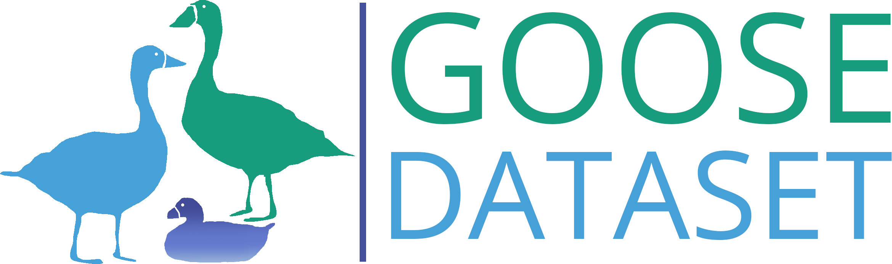
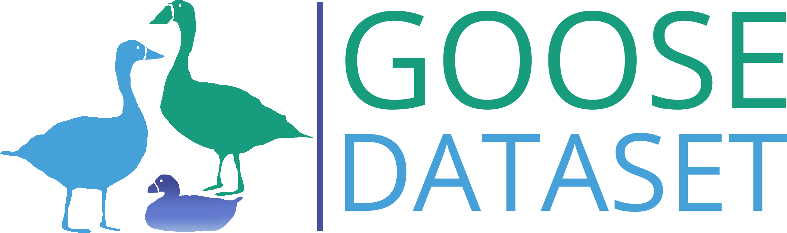

# GOOSE Dataset :duck: Official Repository

<!--  -->


<div align="center">

[](https://arxiv.org/abs/2310.16788)
[](https://goose-dataset.de/images/gooseEx.pdf)
[](https://goose-dataset.de/)
[](https://goose-dataset.de/docs/)

</div>

This repository contains some tools for training and benchmarking with the GOOSE Dataset.

## Download

The data structure and more in-depth information about the format can be found int the [documentation](https://goose-dataset.de/docs/dataset-structure/). The data is divided into 3 splits: train, test and validation. Labeled data is available for train and validation splits. 

It can be downloaded from [our webpage](https://goose-dataset.de/docs/setup/#download-dataset). 

In `scripts` you can find some scripts to directly download and unpack the 2D data.

## Data Visualization

Under `tools`, some scritps can be found to visualize the GOOSE data.

### 2D Data

Run the `tools/visualize_2d_data.py` script to display some images from the downloaded data. Please refer to the script's argument parser for more information.


### 3D Data [TODO]

## Utilities

Under the folder `common` some general configuration files and utils such as color maps can be found.

## Acknowledgements [TODO]

## Citation

Please cite us if this data is useful for you work:

```bibtex
@article{goose-dataset,
    author = {Peter Mortimer and Raphael Hagmanns and Miguel Granero
              and Thorsten Luettel and Janko Petereit and Hans-Joachim Wuensche},
    title = {The GOOSE Dataset for Perception in Unstructured Environments},
    url={https://arxiv.org/abs/2310.16788},
    conference={2024 IEEE International Conference on Robotics and Automation (ICRA)}
    year = 2024
}

@article{goose-ex-dataset,
    author = {Raphael Hagmanns and Peter Mortimer and Miguel Granero
              and Thorsten Luettel and Janko Petereit},
    title = {Excavating in the Wild: The GOOSE-Ex Dataset for Semantic Segmentation},
    url={},
    conference={TBA}
    year = 2024
} 
```

## License

- This **repository** is licensed under the **MIT License**.
- The **data** is published under the **CC BY-SA 4.0 License**.

## Mantainers

- [Miguel Granero](mailto:miguel.granero@iosb.fraunhofer.de)
- [Raphael Hagmanns](mailto:raphael.hagmanns@iosb.fraunhofer.de)
- [Peter Mortimer](mailto:peter.mortimer@unibw.de)

GOOSE is a project of [Fraunhofer IOSB](https://www.iosb.fraunhofer.de/de/kompetenzen/systemtechnik/mess-regelungs-diagnosesysteme.html), [UniBW Munich](https://www.unibw.de/tas) and [University of Koblenz](https://www.uni-koblenz.de/de/informatik/icv/paulus).
